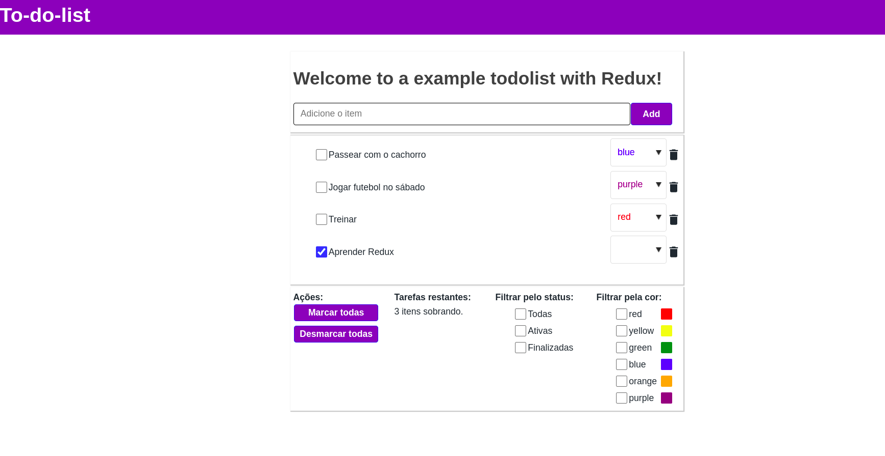

### To Do List (com Redux)

> Projeto para treinar os conhecimentos de Redux

Esse projeto foi criado com o objetivo de treinar e entender melhor como a biblioteca do Redux funciona, principalmente com React. 

#### Tecnologias utilizadas: :pen: 
- **React**: biblioteca UI;
- **React-Redux**: biblioteca do Redux para projetos React;
- **Redux-Saga**: middleware do Redux, que funciona para melhor organização de operações assíncronas na aplicação.
- **Styled-components**: biblioteca do React.
- **Axios**: biblioteca para consumir APIs.
- **MirageJS**: biblioteca para criar fakes API.

O projeto é referente a uma lista de coisas há se fazer. 

#### Deve ser possível: :book:

- Adicionar uma tarefa;
- Remover uma tarafa;
- Marcar a tarefa como feita;
- Desmarcar a tarefa como feita;
- Alterar a cor referente a tarefa;
- Filtrar as tarefas pelas cores;
- Filtrar as tarefas pelos status de completo e ativa.
- Filtrar simultâneamente pelas cores e status.
- Marcar todas de uma vez.
- Desmarcar todas de uma vez.
- A quantidade de tarefas restantes a ser feita, deve sempre ser exibidas em tela.

O gerenciamento das **todos** foi todo feito utilizando o store do Redux, ao invés de armazená-lo em um estado normal e passar para os componentes via Context API.

Para criar a store, foi utilizado o conceito de reducers e actions divididos por módulos, onde há um reducers principal que agrupa todos os outros e é jogado diretamente no createStore. 

O Sagas foi utilizado para lidar com operações assíncronas na aplicação, como as chamadas para API, para consultar o banco etc. O middleware do Saga também foi divido dentro dos módulos, possuindo um principal que agrupa todos os outros e esse qual é colocado como middleware na store.

Apesar de uma aplicação extremamente básica, ela ilustra muito bem como o Redux e o Redux-Saga podem ser utilizados em uma aplicação. **Conceitos aprendidos** na construção foram:

- O que é e como funciona a store, o state, os reducers e as actions no Redux.
- O gerenciamento de state com Redux. 
- Generators functions no JavaScript.
- Como funciona o middleware Redux-Saga.
- Estruturação de pastas por módulos no Redux.

That's all folks! Never stop learning!